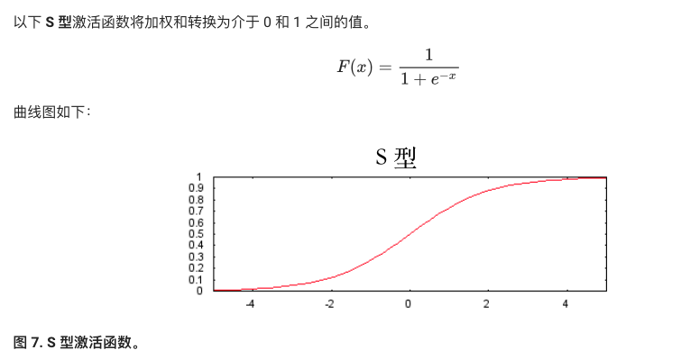
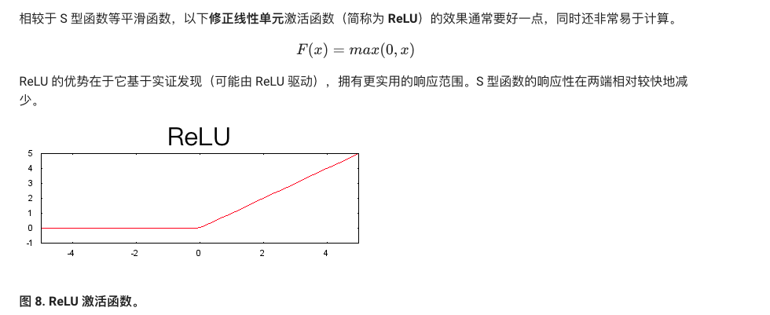

##刨析
1. 常见激活函数 

 
 
 
 
 

[各种激活函数详见官网](https://www.tensorflow.org/api_guides/python/nn)

###总结
现在，我们的模型拥有了人们通常所说的“神经网络”的所有标准组件：

1. 一组节点，类似于神经元，位于层中。
   
2. 一组权重，表示每个神经网络层与其下方的层之间的关系。下方的层可能是另一个神经网络层，也可能是其他类型的层。
   
3. 一组偏差，每个节点一个偏差。
   
4. 一个激活函数，对层中每个节点的输出进行转换。不同的层可能拥有不同的激活函数。

##playground
对于神经网络而言，过拟合是一种真正的潜在危险。您可以查看训练数据损失与验证数据损失之间的差值，以帮助判断模型是否有过拟合的趋势。如果差值开始变大，则通常可以肯定存在过拟合。

